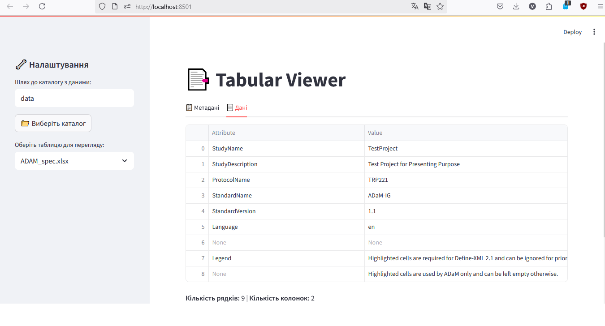
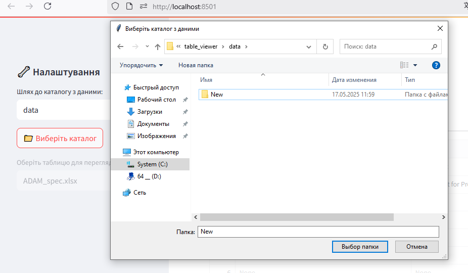
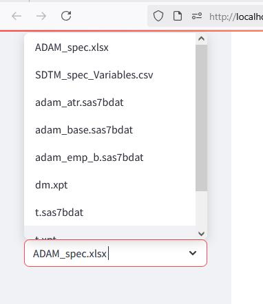
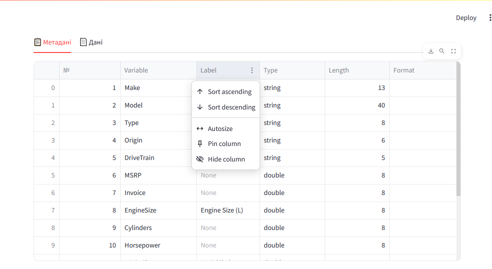
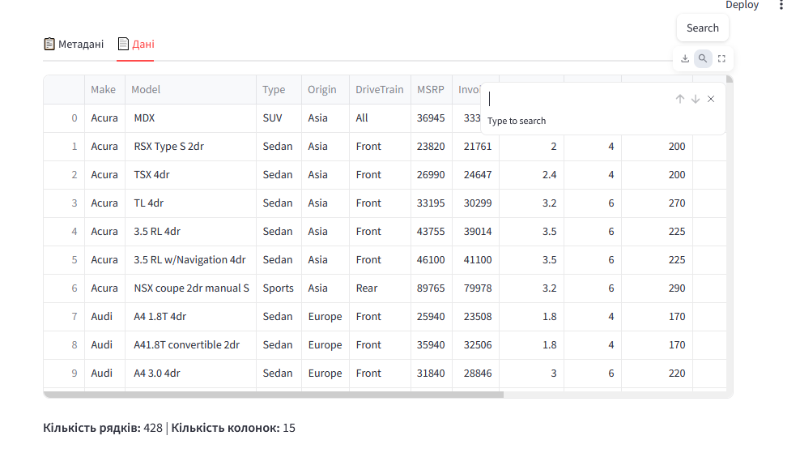

# Tabular Viewer
**Tabular Viewer** — це Streamlit-додаток для зручного перегляду табличних даних і супутніх метаданих з локального каталогу. Підтримуються популярні формати даних, включаючи **SAS** (`.sas7bdat`, `.xpt`), **CSV**, **Excel**, а також **автоматичне зіставлення зовнішніх специфікацій**.


---

## ✨ Основні можливості

- **Підтримка різних форматів**: `.sas7bdat`, `.xpt`, `.csv`, `.xlsx`
- **Автоматичне зчитування метаданих** з SAS-файлів через `pyreadstat`
- **Інтеграція зовнішніх метаданих**: Завантаження та спроба зіставлення зовнішніх CSV/Excel файлів як метаданих (наприклад, файлів специфікацій змінних).
- **Кастомний вибір директорії**: Можливість вказати або вибрати довільний каталог для даних.
- **Інтерфейс з вкладками**:
  - **Метадані** — перелік змінних, типів, довжини, форматів, описів
  - **Дані** — перегляд таблиці з кількістю рядків і колонок
- **Кешування** для швидшої робот
---

## 🚀 Як запустити

Щоб запустити цей додаток, виконайте наступні кроки:

### Передумови

* **Python 3.7+**
* **pip** (менеджер пакетів Python)

### Встановлення залежностей

1.  **Клонуйте репозиторій** (якщо ви розмістите його на GitHub) або завантажте файли.
2.  Відкрийте термінал або командний рядок у каталозі з файлом `app.py` (або як ви назвали свій основний файл).
3.  Встановіть усі залежності з requirements.txt:

    ```bash
    pip install -r requirements.txt
    ```
    або вручну:
    ```bash
    pip install streamlit pandas pyreadstat openpyxl tk
    ```
    * `openpyxl` потрібен для роботи з файлами `.xlsx`.
    * `tk` (Tkinter) потрібен для вікна вибору каталогу.

### Підготовка даних

1.  Створіть папку з назвою `data` (або будь-яку іншу назву, яку ви вкажете в додатку) у тому ж каталозі, де знаходиться ваш файл `main.py`.
2.  Помістіть свої табличні дані (файли `.sas7bdat`, `.xpt`, `.csv`, `.xlsx`) та супутні метадані (якщо є, у форматах `.csv` або `.xlsx`) в цю папку.

    Приклад структури каталогу:

    ```
    .
    ├── main.py
    └── data/
        ├── adam_atr.sas7bdat
        ├── adam_base.sas7bdat
        ├── adam_emp_b.sas7bdat
        ├── SDTM_spec_Variables.csv
        ├── dm.xpt
        ├── ADAM_spec.xlsx
        ├── t.sas7bdat
        ├── t.xpt
        └── t3.sas7bdat
    ```

### Запуск додатку

1.  У терміналі або командному рядку, перебуваючи в каталозі з файлом `main.py`, виконайте:

    ```bash
    streamlit run main.py
    ```
### Вариант 2: За допомогою Docker/Podman
Створити образ:
```bash
docker build -t tabular-viewer .
```
Запустити:
```bash
docker run -p 8501:8501 tabular-viewer
```
Якщо потрібно змонтувати локальну папку data
```bash
docker run -p 8501:8501 -v "$(pwd)/data:/app/data" tabular-viewer
```
Після цього додаток буде доступний у браузері за адресою:
 http://localhost:8501

**ВАЖЛИВО!!**
 В контейнері немає графічного оточення. Контейнери не підтримують GUI за промовчанням, оскільки вони працюють у headless-режимі (без екрану)..Тому кнопка обирання папки працювати не буде

### Детальний опис алгоритму та методів
## 💻Інтерфейс
Після запуску додатку зʼявиться веб-інтерфейс Streamlit у наступному вигляді:

- Кнопка для вибору локальної папки з файлами даних
- Після вибору — список доступних файлів у цій папці



- Dropdown-меню для вибору конкретного файлу (SAS, XPT, CSV, XLSX)
- Автоматичне завантаження даних і метаданих після вибору



Інтерфейс містить дві вкладки:

#### 1. **📋 Метадані**

- Таблиця зі змінними, їх описами, типами, форматами
- Джерело: або вбудовані SAS-метадані, або зовнішні специфікації
- Автоматичне зіставлення відповідного набору метаданих
- Можливість фільтрувати дані прямо через інтерфейс Streamlit (наприклад, за допомогою стандартного пошуку/фільтрів у таблицях)
- Підтримка інтерактивної роботи з таблицею: сортування, пошук, скрол



#### 2. **📄 Дані**

- Таблиця з даними (`DataFrame`)
- Відображення кількості рядків і колонок
- Можливість скролу для великих таблиць
- Можливість фільтрувати дані прямо через інтерфейс Streamlit (наприклад, за допомогою стандартного пошуку/фільтрів у таблицях)
- Підтримка інтерактивної роботи з таблицею: сортування, пошук, скрол



## 🧠 Загальна архітектура

Streamlit — основа UI

tkinter — вибір директорії

pyreadstat — зчитування SAS/XPT і метаданих

pandas — робота з таблицями

@st.cache_data — кешування завантажень

## ⚙️ Ключові функції

### `select_directory()`
Відкриває вікно вибору директорії (через `tkinter`) і повертає шлях.

---

### `load_data_with_meta(file_name)`
Завантажує дані з обраного файлу. Повертає `DataFrame` та метадані (якщо є).  
Підтримувані формати: `.sas7bdat`, `.xpt`, `.csv`, `.xlsx`.

---

### `load_all_metadata()`
Шукає у каталозі всі CSV/XLSX файли, які потенційно містять метадані.  
Парсить їх і зберігає у словник.

---

### `parse_sdtm_metadata(path)`
Обробляє специфічний файл `SDTM_spec_Variables.csv`.  

---

### `find_matching_metadata(data_filename, df, all_specs)`
Автоматичне зіставлення метаданих до файлу даних:
- За **назвою файлу**
- За полем **`Dataset`**
- За **перетином змінних** між даними та метаданими

---

### `describe_column(col, metadata_df, _meta)`
Описує кожну колонку на основі зовнішніх (`metadata_df`) і внутрішніх (`_meta`) метаданих.